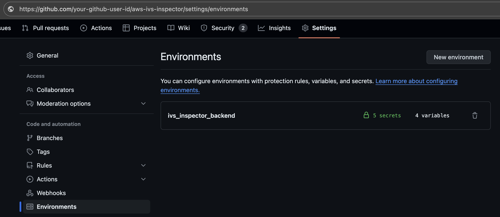

# NOTE—Creating this infrastructure may incur costs. Please refer to the AWS pricing for more information.

## Installation

This installation guide leverages GitHub Actions to streamline the deployment process. Ensure you have the necessary permissions and configurations in place before proceeding.

#### Prerequisites

- **AWS Account & Permissions:** An AWS account with an IAM user possessing `AdministratorAccess` policy.
- **Important:** Limit or remove these permissions after deployment for security best practices.
- **S3 Bucket:** An S3 bucket to store Terraform state files. Note the bucket name and region.

<!-- #### GitHub Configuration

1. **Personal Access Token:**

   - Go to your GitHub profile settings > `Developer settings` > `Personal access tokens` > `Tokens (classic)`. Quick access: https://github.com/settings/tokens
   - Generate a new token with `repo` scope (full control of private repositories).
   - Save the token securely; you'll need it for the GitHub Actions secrets.

   

   

2. **Repository Workflow Permissions:**

   - In your IVS Inspector repository, go to `Settings` > `Actions` > `General`.
   - Under "Workflow permissions," select `Read and write permissions`.

   

3. **GitHub Environment:**

   - Go to your repository's `Settings` > `Environments`.
   - Create a new environment named `ivs_inspector_backend`.

   

4. **GitHub Actions Secrets:**

   - Navigate to IVS Inspector repository > `Settings` > `Environments`.
   - Hover and click the `ivs_inspector_backend`, which you just created at `step #3`.
   - Click `Add environment secret` in Environment secrets and add all `Secret` type. Please follow the same name.

     | Secret Name                  | Description                                                |
     | ---------------------------- | ---------------------------------------------------------- |
     | `AWS_ACCOUNT_ID`             | Your AWS Account ID                                        |
     | `AWS_ACCESS_KEY_ID`          | Temporary AWS Access Key with Administrative access        |
     | `AWS_SECRET_ACCESS_KEY`      | Temporary AWS Secret Access Key with Administrative access |
     | `AWS_S3_BUCKET_FOR_TF_STATE` | Name of the S3 bucket to store Terraform state files       |
     | `GH_PERSONAL_ACCESS_TOKEN`   | The GitHub Personal Access Token generated in step 1       |

   - Click `Add environment variable` in Environment variables and add all `Variable` type. Please follow the same name.

     | Variable Name                       | Description                                                     | Default Value                   |
     | ----------------------------------- | --------------------------------------------------------------- | ------------------------------- |
     | `AWS_S3_BUCKET_FOR_TF_STATE_REGION` | Region of the S3 bucket storing Terraform state files           |                                 |
     | `IVS_PROJECT_NAME`                  | Name for your IVS Inspector project                             | `ivs-inspector`                 |
     | `AWS_AMPLIFY_DEPLOYED_REGION`       | AWS region to deploy the web application                        |                                 |
     | `TF_VAR_region`                     | AWS region to deploy infrastructure (used in `02-tf-infra.yml`) | `ap-south-1` (modify as needed) | -->

#### Deployment

<!-- **Trigger Workflows:**

- Manually trigger the following GitHub Actions workflows in your repository with `Run Workflow` button, in the following order:

  1.  **`01-tf-amplify.yml`:** Deploys the AWS Amplify application.
      > **Note:** If you're hosting the Web Application using Amplify to a desired region, you may update the value of `AWS_AMPLIFY_DEPLOYED_REGION` in the `Environment variable`.
  2.  **`02-tf-infra.yml`:** Sets up the AWS infrastructure.
      > **Note:** If you're deploying infrastructure to another or additional region to inspect the IVS Channel resources, you may update the value of `TF_VAR_region` in the workflow file `02-tf-infra.yml` at the `line #6` for each run/region. And the edit can be done within the GitHub repo.
  3.  **`03-awscli-web.yml`:** Deploys the IVS Inspector web application.
      > **Note:** The `AWS_AMPLIFY_APP_ID` variable is automatically set by the `01-tf-amplify.yml` workflow and used by `03-awscli-web.yml`.

   -->

## Accessing the Web Application

1. After all workflows complete successfully, go to the AWS console.
2. Navigate to the Amplify service in the region where you deployed your application.
3. Select your IVS Inspector application.
4. Under "Overview" > "Production branch," click the domain link to access your deployed IVS Inspector application.
5. You can now use the IVS Inspector web application using the default username `admin@ivs-inspector.com`, and the password `123Qwe,./`

## Renaming the Project

If you wish to change the default project name (`ivs-inspector`):

1. Go to your repository's `Settings` > `Secrets and variables` > `Actions`.
2. Update the value of the `IVS_PROJECT_NAME` variable.

## Pricing and Resource Usage

This document details the AWS resources used by IVS Inspector, their usage patterns, and associated costs, both during operation and at rest.

## Resource Usage

The following AWS services are used:

- **AWS Lambda:** [List Lambda functions and their purpose, e.g., API endpoints, stream processing].
- **Amazon API Gateway:** [Explain its role, e.g., exposing Lambda functions as HTTP APIs].
- **Amazon S3:** [Describe how S3 is used, e.g., storing Terraform state, website hosting].
- **AWS Amplify (If applicable):** [Explain how Amplify is used, e.g., web app hosting, CI/CD].
- **Amazon DynamoDB (If applicable):** [Describe how it is used, e.g. storing passenger and vehicle data.]
- **Amazon Cognito (if applicable):** [Describe how it is used, e.g., for Authentication.]

Example cost breakdown for a single lambda function:

- **`list-channels`:**
  - Memory: 128 MB
  - Estimated Invocations/month: 10,000
  - Estimated Avg. Duration: 200ms
  - Estimated Cost: $0.00417/month (calculated as shown above)

## Pricing

Costs are categorized by service and usage type.

**(Repeat this section for EACH service identified above)**

### [Service Name] (e.g., Amazon IVS)

**Operational Costs ("On Usage"):**

- [Specific usage metrics and pricing. E.g., IVS Channel Hours, Ingest hours, Playback hours].
- [Example: Channel Hours: $X per hour. Estimated usage: Y hours/month. Estimated monthly cost: $X * Y].

**Costs at Rest:**

- [Describe costs incurred even when the service isn't actively processing, e.g., storage fees for DynamoDB, data storage for S3].
- [Example: Storage costs for recordings are $Z per GB. Expected usage A GB. Expected monthly cost $Z * A.]

**Pricing Link:** [Link to the official AWS pricing page for this service].

## Cost Optimization Strategies (General)

- **Right-sizing:** Choose appropriate instance sizes for EC2, Lambda memory for Lambda functions, etc.
- **Scheduled Start/Stop:** Configure scheduled start/stop for EC2 instances or other resources used only during specific times.
- **Delete Unused Resources:** Remove unused resources when no longer required.
- **Free Tier:** Utilize the AWS Free Tier whenever possible.

## Detailed Pricing Information

[Add any further context on pricing estimates and how they were calculated].
